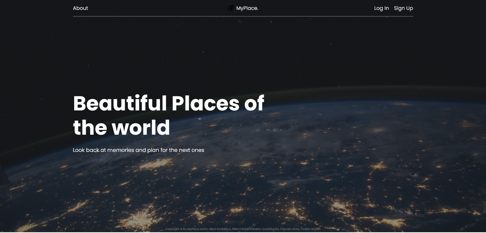
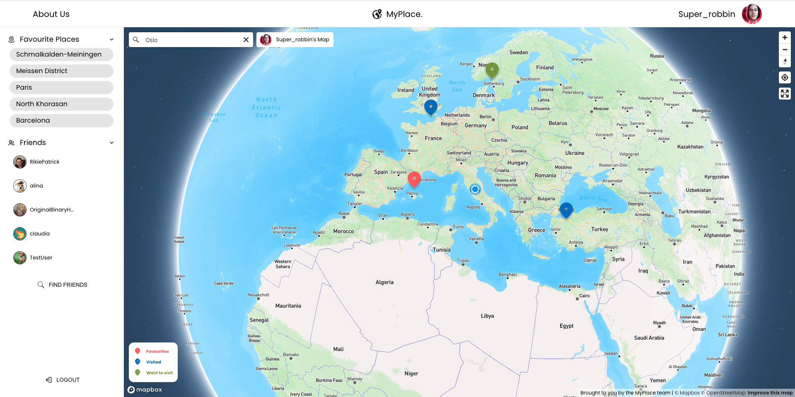

# MyPlace - Your Personal Travel Companion

MyPlace is your go-to app for tracking and sharing your travel experiences with friends and fellow adventurers. With MyPlace, you can effortlessly pin your visited and dream destinations on an interactive map, creating a visual travelogue that tells your unique story. Whether you're a globetrotter, a weekend explorer, or just planning your next getaway, MyPlace has you covered.





## Our Team

* **[Rikie Patrick](https://github.com/1sAndZeros)**
* **[Roberto Quadraccia](https://github.com/super-robbin)**
* **[Alina Ermakova](https://github.com/alalinaermakova)**
* **[Claudia Alves](https://github.com/claudiasalves)**
* **[Yasien Watkin](https://github.com/originalbinaryhustler)**

## Tech stack

**Frontend:**


**Backend:**


## Card wall

[Trello Board can be found here](https://trello.com/b/64cE4eZx/myplace)

## Quickstart

### Set up your project

1. Fork this repository
2. Clone your fork to your local machine
3. Install Node.js dependencies for both the `frontend` and `api` directories.

   ```bash
   cd api
   npm install
   cd ../frontend
   npm install
   ```

4. Install an ESLint plugin for your editor. For example: [`linter-eslint`](https://github.com/AtomLinter/linter-eslint) for Atom.

5. Install MongoDB

   ```bash
   brew tap mongodb/brew
   brew install mongodb-community@5.0
   ```

6. Start MongoDB

   ```bash
   brew services start mongodb-community@5.0
   ```

7. Setup environment variables

   Copy the .env.example file and rename .env  
   update the relevent variable values

### Start the server

1. Start the server application (in the `api` directory)

   ```bash
   cd api
   npm run dev
   ```

2. Start the front end application (in the `frontend` directory)

   In a new terminal session...

   ```bash
   cd frontend
   npm run dev
   ```

You should now be able to open your browser and go to `http://localhost:5173/signup` to create a new user.

Then, after signing up, you should be able to log in by going to `http://localhost:5173/login`.

After logging in, you won't see much but you can create posts using PostMan and they should then show up in the browser if you refresh the page.
